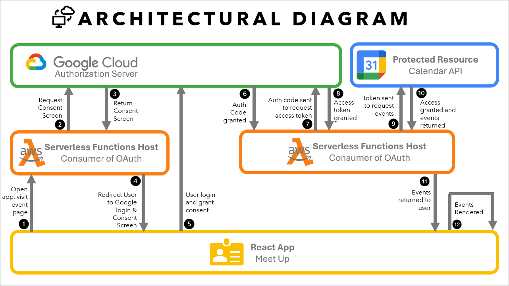

# Welcome to CliqueUP!

The app where you can find events near you!

A serverless, progressive web application (PWA) built with React that fetches and displays upcoming events using the Google Calendar API. This project follows Test-Driven Development (TDD) practices.

## Table of Contents

- [Welcome to CliqueUP!](#welcome-to-cliqueup)
  - [Table of Contents](#table-of-contents)
  - [Features](#features)
    - [Architectural Diagram](#architectural-diagram)
    - [User Stories](#user-stories)
      - [Feature 1: Filter Events by City](#feature-1-filter-events-by-city)
      - [Feature 2: Show/Hide Event Details](#feature-2-showhide-event-details)
      - [Feature 3: Specify Number of Events](#feature-3-specify-number-of-events)
      - [Feature 4: Use the App When Offline](#feature-4-use-the-app-when-offline)
      - [Feature 5: Add an App Shortcut to the Home Screen](#feature-5-add-an-app-shortcut-to-the-home-screen)
      - [Feature 6: Display Charts Visualizing Event Details](#feature-6-display-charts-visualizing-event-details)
  - [Technologies Used](#technologies-used)
    - [Dependencies](#dependencies)
    - [Dev Dependencies](#dev-dependencies)
  - [Getting Started](#getting-started)
    - [Prerequisites](#prerequisites)
    - [Installation](#installation)
  - [Running the Application](#running-the-application)
  - [Running Tests](#running-tests)
  - [Serverless Deployment](#serverless-deployment)
  - [Contributing](#contributing)
  - [License](#license)

## Features

- View upcoming events from Google Calendar by city
- Offline functionality
- Responsive design
- Display Charts Visualizing Event Details

### Architectural Diagram



### User Stories

#### Feature 1: Filter Events by City

As a user, I want to filter events by city so that I can find events happening in my local area or a specific location I'm interested in.

```gherkin
Feature: Filter Events by City

Scenario: When user hasn’t searched for a city, show upcoming events from all cities
  Given user hasn’t searched for any city
  When the user opens the app
  Then the user should see the list of upcoming events

Scenario: User should see a list of suggestions when they search for a city
  Given the main page is open
  When user starts typing in the city textbox
  Then the user should see a list of cities (suggestions) that match what they’ve typed

Scenario: User can select a city from the suggested list
  Given the user was typing “Berlin” in the city textbox AND the list of suggested cities is showing
  When the user selects a city (e.g., “Berlin, Germany”) from the list
  Then their city should be changed to that city (i.e., “Berlin, Germany”) AND the user should
  receive a list of upcoming events in that city

Scenario: User filters for a city with no events
  Given the user is on the event listing page
  When the user selects "Small Town" from the city filter options
  And there are no events scheduled in Small Town
  Then the app should display a message "No events found in Small Town"
```

#### Feature 2: Show/Hide Event Details

As a user, I want to be able to show or hide event details so that I can quickly scan through events and focus on the ones I'm most interested in.

```gherkin
Feature: Show/Hide Event Details

Scenario: An event element is collapsed by default
  Given the user is viewing the list of events
  Then all event elements should be in a collapsed state

Scenario: User can expand an event to see details
  Given the user is viewing the list of events
  When the user clicks on a collapsed event element
  Then the event element should expand
  And the event details should be visible

Scenario: User can collapse an event to hide details
  Given the user is viewing an expanded event element
  When the user clicks on the expanded event element
  Then the event element should collapse
  And the event details should be hidden

Scenario: User expands multiple event details
  Given the user is viewing the event list
  When the user clicks to show details for multiple events
  Then the app should display expanded details for all selected events simultaneously

Scenario: User collapses all expanded event details
  Given multiple events have their details expanded
  When the user clicks a "Collapse All" button
  Then the app should hide the details for all events
```

#### Feature 3: Specify Number of Events

As a user, I want to specify the number of events displayed so that I can control the amount of information I see at once.

```gherkin
Feature: Specify Number of Events

Scenario: When user hasn't specified a number, 32 events are shown by default
  Given the user hasn't specified a number of events to display
  When the user loads the event list
  Then 32 events should be displayed

  Scenario: User can change the number of events displayed
  Given the user is viewing the event list
  When the user specifies a different number of events to display
  Then the specified number of events should be shown
  And the event list should update accordingly

Scenario: User requests more events than available
  Given there are 15 total events
  When the user selects "50" from the "Number of Events" dropdown
  Then the app should display all 15 available events
  And show a message "Displaying all 15 available events"

Scenario: User changes number of events while filtered
  Given the user has filtered events for "Chicago"
  And there are 10 events in Chicago
  When the user changes the "Number of Events" to 5
  Then the app should display only 5 events from Chicago
```

#### Feature 4: Use the App When Offline

As a user, I want to use the app when offline so that I can access event information even without an internet connection.

```gherkin
Feature: Use the App When Offline

Scenario: User accesses the app without internet connection
  Given the user has previously loaded the app with an internet connection
  When the user opens the app without an internet connection
  Then the app should display the last cached version of events and their details

Scenario: User tries to refresh data while offline
  Given the user is using the app offline
  When the user attempts to refresh the event data
  Then the app should display a message "Unable to update. Please check your internet connection"

Scenario: App comes back online
  Given the user has been using the app offline
  When the internet connection is restored
  And the user refreshes the app
  Then the app should update with the latest event data
  And display a message "Event data updated successfully"
```

#### Feature 5: Add an App Shortcut to the Home Screen

As a user, I want to add an app shortcut to my home screen so that I can quickly access the app without navigating through my device's app menu.

```gherkin
Feature: Add an App Shortcut to the Home Screen

Scenario: User adds app shortcut to home screen
  Given the user has the app open in their mobile browser
  When the user selects the "Add to Home Screen" option from the browser menu
  Then the browser should create a shortcut to the app on the user's home screen

Scenario: User attempts to add shortcut on unsupported browser
  Given the user is using a browser that doesn't support adding shortcuts
  When the user tries to add the app to the home screen
  Then the app should display a message explaining the feature is not supported
  And provide alternative instructions for bookmarking the app

Scenario: User launches app from home screen shortcut
  Given the user has added the app shortcut to their home screen
  When the user taps the app shortcut
  Then the app should launch directly, bypassing the browser interface
```

#### Feature 6: Display Charts Visualizing Event Details

As a user, I want to see charts visualizing event details so that I can easily understand trends and patterns in the event data.

```gherkin
Feature: Display Charts Visualizing Event Details

Scenario: User views charts of event data
  Given the user is on the event statistics page
  When the page loads
  Then the app should display charts visualizing various aspects of event data

Scenario: User interacts with a chart
  Given the user is viewing the event statistics page
  When the user clicks on a specific data point in a chart
  Then the app should display detailed information about that data point

Scenario: User filters chart data
  Given the user is viewing a chart of events by category
  When the user selects specific categories to include or exclude
  Then the chart should update to reflect only the selected categories

Scenario: User views charts with no data
  Given there are no events in the system
  When the user navigates to the event statistics page
  Then the app should display a message "No data available for visualization"
  And provide an option to add sample data for demonstration purposes

```

## Technologies Used

- React
- Progressive Web App (PWA) technologies
- Google Calendar API
- Jest and React Testing Library for TDD
- AWS

### Dependencies
-	@testing-library/jest-dom	: 	^6.5.0
-	@testing-library/user-event	: 	^14.5.2
-	atatus-spa	: 	^4.6.2
-	bootstrap	: 	^5.3.3
-	bootstrap-icons	: 	^1.11.3
-	react	: 	^18.3.1
-	react-bootstrap	: 	^2.10.4
-	react-dom	: 	^18.3.1
-	react-scripts	: 	^5.0.1
-	recharts	: 	^2.12.7
-	web-vitals	: 	^2.1.4
-	workbox-background-sync	: 	^6.6.0
-	workbox-broadcast-update	: 	^6.6.0
-	workbox-cacheable-response	: 	^6.6.0
-	workbox-core	: 	^6.6.0
-	workbox-expiration	: 	^6.6.0
-	workbox-google-analytics	: 	^6.6.1
-	workbox-navigation-preload	: 	^6.6.0
-	workbox-precaching	: 	^6.6.0
-	workbox-range-requests	: 	^6.6.0
-	workbox-routing	: 	^6.6.0
-	workbox-strategies	: 	^6.6.0
-	workbox-streams	: 	^6.6.0
      
### Dev Dependencies		
-	@babel/plugin-proposal-private-property-in-object	: 	^7.16.7
-	@testing-library/dom	: 	^10.4.0
-	@testing-library/react	: 	^16.0.0
-	@testing-library/user-event	: 	^14.5.2
-	gh-pages	: 	^6.1.1
-	jest	: 	^29.7.0
-	jest-cucumber	: 	^4.5.0
-	jest-watch-typeahead	: 	^2.2.2
-	nprogress	: 	^0.2.0
-	puppeteer	: 	^18.1.0


## Getting Started

### Prerequisites

- Node.js (v14 or later)
- npm (v6 or later)
- Google Cloud Platform account with Calendar API enabled

### Installation

1. Clone the repository:

   ```
   git clone https://github.com/eahowell/meet.git
   cd meet
   ```

2. Install dependencies:

   ```
   npm install
   ```

3. Set up environment variables:
   Create a `.env` file in the root directory and add your Google Calendar API credentials:
   ```
   REACT_APP_GOOGLE_API_KEY=your_api_key
   REACT_APP_GOOGLE_CLIENT_ID=your_client_id
   ```

## Running the Application

To start the development server:

```
npm start
```

Visit `http://localhost:3000` in your browser to view the application.

## Running Tests

This project uses Jest and React Testing Library for unit and integration tests. To run the tests:

```
npm test
```

To run all tests in watch mode and get testing coverage:

```
npm test -- --coverage --watchAll
```

## Serverless Deployment

1. Install Serverless
```
npm install -g serverless 
```
2. Create a Serverless Service
```
serverless create --template aws-nodejs --path auth-server
cd auth-server
npm init 
```

3. Configuring Your AWS Credentials
   - Obtain security credentials from [AWS Management Console](https://aws.amazon.com/console/)
   - Configure your new AWS credentials for Serverless
     - Make sure you replace ACCESS_KEY_ID and SECRET_ACCESS_KEY with your own credentials! 
```
serverless config credentials --provider aws --key ACCESS_KEY_ID --secret SECRET_ACCESS_KEY
```

   
## Contributing

1. Fork the repository
2. Create your feature branch (`git checkout -b feature/AmazingFeature`)
3. Commit your changes (`git commit -m 'Add some AmazingFeature'`)
4. Push to the branch (`git push origin feature/AmazingFeature`)
5. Open a Pull Request

## License
