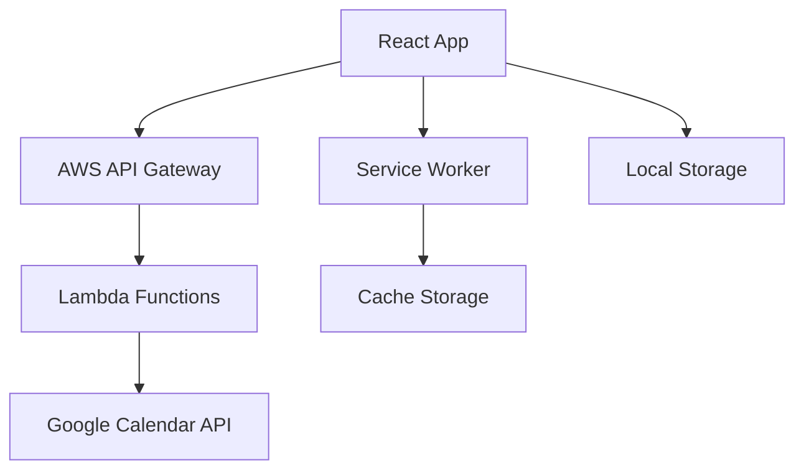

# CliqueUP 🎉

<div align="center">
  
  
  **The app where you can find events near you!**
  
  [](https://github.com/eahowell/meet)
  [](https://eahowell.github.io/meet/)
  [](https://reactjs.org/)
  [](https://web.dev/progressive-web-apps/)

  [Live Demo](https://eahowell.github.io/meet/) • [Report Bug](https://github.com/eahowell/meet/issues) • [Request Feature](https://github.com/eahowell/meet/issues)
</div>

---

## 🚀 About CliqueUP

CliqueUP is a modern, serverless Progressive Web Application (PWA) that helps you discover and explore upcoming events in your area. Built with React and powered by the Google Calendar API, it offers a seamless experience whether you're online or offline.

### ✨ Key Features

- 🌍 **City-based Event Discovery** - Find events in any city worldwide
- 📱 **Progressive Web App** - Install on your device for native app experience
- 🔍 **Smart Filtering** - Filter events by location and customize display count
- 📊 **Data Visualization** - Interactive charts showing event statistics
- 🌐 **Offline Support** - Access cached events without internet connection
- 🎨 **Responsive Design** - Optimized for all screen sizes
- ⚡ **Fast & Lightweight** - Serverless architecture for optimal performance


## 🛠️ Tech Stack

### Frontend
- **React 18.3.1** - Modern UI library with hooks
- **Bootstrap 5.3.3** - Responsive CSS framework
- **Recharts 2.12.7** - Interactive data visualization
- **React Bootstrap 2.10.4** - Bootstrap components for React

### Backend & APIs
- **Google Calendar API** - Event data source
- **AWS Lambda** - Serverless functions
- **OAuth 2.0** - Secure authentication

### Development & Testing
- **Jest 29.7.0** - JavaScript testing framework
- **React Testing Library** - Component testing utilities
- **Puppeteer 18.1.0** - End-to-end testing
- **Jest-Cucumber 4.5.0** - Behavior-driven development

### DevOps & Deployment
- **GitHub Pages** - Frontend hosting
- **AWS API Gateway** - API management
- **Serverless Framework** - Infrastructure as code
- **Service Workers** - Offline functionality

## 🏗️ Architecture


```mermaid
graph TB
    A[React App] --> B[AWS API Gateway]
    B --> C[Lambda Functions]
    C --> D[Google Calendar API]
    A --> E[Service Worker]
    E --> F[Cache Storage]
    A --> G[Local Storage]
```

## 🚀 Quick Start

### Prerequisites

Before you begin, ensure you have:
- **Node.js** (v16 or higher)
- **npm** (v8 or higher)
- **Google Cloud Platform account** with Calendar API enabled
- **AWS account** (for serverless deployment)

### Installation

1. **Clone the repository**
   ```bash
   git clone https://github.com/eahowell/meet.git
   cd meet
   ```

2. **Install dependencies**
   ```bash
   npm install
   ```

3. **Set up environment variables**
   
   Create a `.env` file in the root directory:
   ```env
   REACT_APP_GOOGLE_API_KEY=your_google_api_key
   REACT_APP_GOOGLE_CLIENT_ID=your_google_client_id
   ```

4. **Start the development server**
   ```bash
   npm start
   ```

5. **Open your browser**
   
   Navigate to `http://localhost:3000`

## ⚙️ Configuration

### Google Calendar API Setup

1. Go to the [Google Cloud Console](https://console.cloud.google.com/)
2. Create a new project or select an existing one
3. Enable the Google Calendar API
4. Create credentials (API key and OAuth 2.0 client ID)
5. Add your domain to authorized JavaScript origins

### AWS Setup (for serverless backend)

1. **Install Serverless Framework**
   ```bash
   npm install -g serverless
   ```

2. **Configure AWS credentials**
   ```bash
   serverless config credentials --provider aws --key YOUR_ACCESS_KEY --secret YOUR_SECRET_KEY
   ```

3. **Deploy the backend**
   ```bash
   cd auth-server
   npm install
   serverless deploy
   ```

## 🧪 Testing

Run the comprehensive test suite:

```bash
# Run all tests
npm test

# Run tests with coverage
npm test -- --coverage --watchAll

# Run end-to-end tests
npm run test:e2e
```

### Test Coverage
- **Unit Tests** - Component logic and functionality
- **Integration Tests** - Component interactions
- **End-to-End Tests** - Complete user workflows
- **BDD Tests** - Cucumber-style behavior testing

## 📦 Deployment

### Frontend (GitHub Pages)

```bash
npm run deploy
```

### Backend (AWS)

```bash
cd auth-server
serverless deploy
```

## 🔧 Available Scripts

| Script | Description |
|--------|-------------|
| `npm start` | Start development server |
| `npm build` | Build for production |
| `npm test` | Run test suite |
| `npm run deploy` | Deploy to GitHub Pages |
| `npm run eject` | Eject from Create React App |

## 📱 Progressive Web App Features

- **Installable** - Add to home screen on mobile/desktop
- **Offline First** - Works without internet connection
- **Push Notifications** - Stay updated with event changes
- **App Shell Architecture** - Fast loading and smooth performance

## 🌐 Browser Support

| Browser | Version |
|---------|---------|
| Chrome | ≥ 70 |
| Firefox | ≥ 65 |
| Safari | ≥ 12 |
| Edge | ≥ 79 |

## 📊 User Stories & Features

<details>
<summary>🏙️ Filter Events by City</summary>

- View events from all cities by default
- Search and filter events by specific cities
- Auto-suggestions for city names
- Handle cities with no available events

</details>

<details>
<summary>👁️ Show/Hide Event Details</summary>

- Events collapsed by default for clean interface
- Expand individual events to see full details
- Support for multiple expanded events
- Bulk collapse all expanded events

</details>

<details>
<summary>🔢 Specify Number of Events</summary>

- Default display of 32 events
- Customizable event count (1-250)
- Handles requests exceeding available events
- Maintains filter state when changing count

</details>

<details>
<summary>📴 Offline Functionality</summary>

- Cache events for offline access
- Show cached data when offline
- Sync when connection restored
- Offline status indicators

</details>

<details>
<summary>📱 Home Screen Installation</summary>

- Add app shortcut to device home screen
- Launch directly without browser interface
- Native app-like experience

</details>

<details>
<summary>📈 Data Visualization</summary>

- Interactive charts showing event statistics
- Events by location scatter chart
- Event topics pie chart
- Responsive chart design

</details>

## 🤝 Contributing

We welcome contributions! Here's how you can help:

1. **Fork the repository**
2. **Create a feature branch**
   ```bash
   git checkout -b feature/AmazingFeature
   ```
3. **Make your changes**
4. **Add tests** for new functionality
5. **Commit your changes**
   ```bash
   git commit -m 'Add some AmazingFeature'
   ```
6. **Push to the branch**
   ```bash
   git push origin feature/AmazingFeature
   ```
7. **Open a Pull Request**

### Development Guidelines

- Follow [React best practices](https://react.dev/)
- Write tests for all new features
- Use meaningful commit messages
- Update documentation as needed
- Ensure all tests pass before submitting PR

## 🐛 Troubleshooting

<details>
<summary>Common Issues</summary>

**Authentication Errors**
- Verify Google API credentials are correct
- Check that your domain is in authorized origins
- Ensure Calendar API is enabled

**Build Failures**
- Clear node_modules and reinstall: `rm -rf node_modules && npm install`
- Check Node.js version compatibility
- Verify all environment variables are set

**Deployment Issues**
- Ensure GitHub Pages is enabled in repository settings
- Check that build completes successfully
- Verify homepage URL in package.json

</details>

## 🙏 Acknowledgments

- [Google Calendar API](https://developers.google.com/calendar) for event data
- [React Team](https://react.dev/community/team) for the amazing framework  
- [CareerFoundry](https://careerfoundry.com/) for project guidance
- [AWS](https://aws.amazon.com/) for serverless infrastructure
- [Bootstrap](https://getbootstrap.com/) for responsive styling

## ✉️ Contact

**Developer:** [Elizabeth Howell](ehowell.webdev@gmail.com)  
**Website:** [Portfolio](http://ehowell-dev.me/PortfolioWebsite/)  
**Twitter:** [ehowell_webdev](https://x.com/ehowell_webdev)  
**GitHub:** [eahowell](https://github.com/eahowell)

## 🔗 Links

- **Live Demo**: [https://eahowell.github.io/meet/](https://eahowell.github.io/meet/)
- **Repository**: [https://github.com/eahowell/meet](https://github.com/eahowell/meet)
- **Issues**: [https://github.com/eahowell/meet/issues](https://github.com/eahowell/meet/issues)

---

<div align="center">
  <p>Made with ❤️ by the CliqueUP team</p>
  <p>⭐ Star this repo if you found it helpful!</p>
</div>